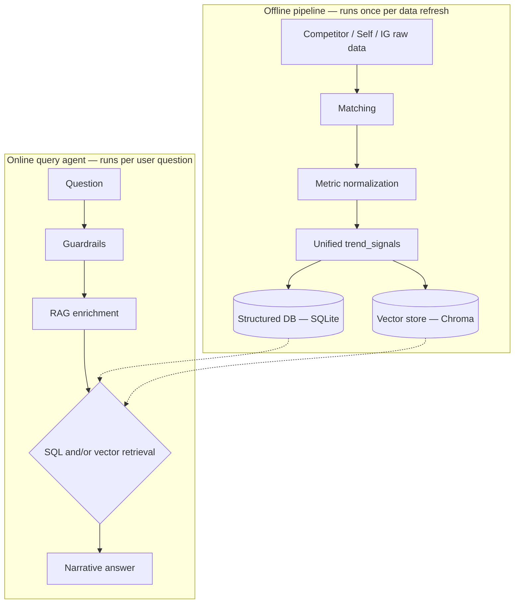
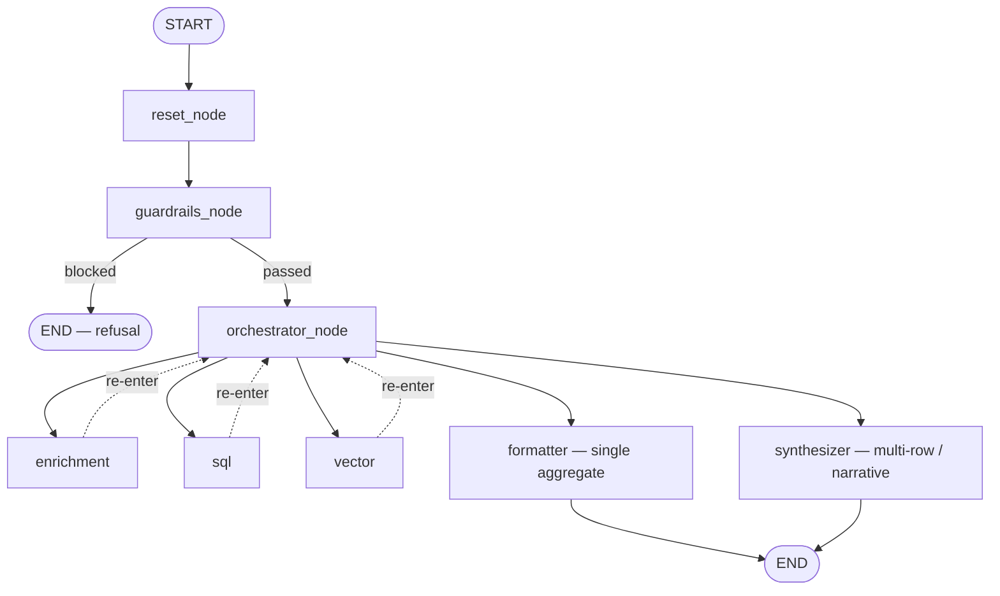

# Fashion Intelligence Platform

A trend-intelligence system for fashion retail: it watches Instagram, competitor
product pages, and our own sell-through data, then answers questions about
what's emerging, what has momentum, and where the white space is.

## Problem statement

> A fashion retailer wants to understand emerging trends and identify
> opportunities for its upcoming collection.

The system ingests three signals and turns them into insight:

| Source | What it captures |
|---|---|
| **Instagram** | Posts and reels — captions, hashtags, engagement |
| **Competitor** | Out-of-stock patterns and rating velocity across competitor PDPs |
| **Self** | Our own sell-through rate and stock status, style by style |

**Insights generated:**
- Emerging fashion trends
- Trend momentum and popularity
- White-space vs. our own catalog
- Cross-source explanations ("what's trending, and *why*")

Built and verified against real generated data in `final_data_v3/` — 90 tagged
images, 32 competitor SKUs, 12 self SKUs, 46 IG posts, all currently in the
`streetwear_tops` category (the other 3 taxonomy categories are defined but
not yet populated).

---

## Architecture

Two halves: an **offline pipeline** that prepares data once per refresh, and
an **online query agent** that answers questions live.



---

## Data preparation

### 1. Matching

Real IG data has no native `category`/`style_tag` — a real pipeline derives
it via **keyword matching on captions/hashtags**, falling back to a **vision
model call** when the text doesn't resolve it confidently. Both paths are
implemented in `matching.py`.

For this project's *mock* data specifically, matching short-circuits to a
direct join against `image_manifest.json`, which already records ground
truth (assigned at generation time) — so the keyword/vision path exists,
tested and ready, but isn't exercised until real, undecorated IG data
replaces the mock set.

**Result:** 46 / 46 IG posts matched, 0 unmatched, 0 vision-API calls needed.

### 2. Metric normalization

One trend rule, applied identically across all three sources:

```python
def week_over_week_trend(series):
    start, end = series[0], series[-1]
    pct_change = 0.0 if start == 0 and end == 0 else (1.0 if start == 0 else (end - start) / start)
    momentum = "rising" if pct_change > 0.10 else "declining" if pct_change < -0.10 else "flat"
    return round(pct_change, 3), momentum
```

- Competitor → `rating_velocity`, 4-week window
- Self → `sell_through_rate`, 4-week window
- Instagram → `likes + comments` aggregated per `(category, style_tag, week)`
  **before** trending (individual posts are too noisy to trend alone)

### 3. Unified `trend_signals` (SQLite)

48 rows, 20 columns, `PRIMARY KEY (source, source_id)`:

| Source | Rows |
|---|---|
| Competitor | 32 |
| Self | 12 |
| Instagram | 4 (tag-week clusters, not per-post) |

Momentum split: **24 rising · 12 flat · 12 declining**

Plus 3 raw pass-through tables (`competitor_pdp`, `self_catalog`, `ig_posts`),
each storing the full original record as a JSON blob — this is what backs
evidence lookups (bullets, captions, permalinks) without bloating
`trend_signals` with every display field.

### 4. Vector store (Chroma)

90 embeddings — one per **raw** record (32 competitor + 12 self + 46 IG
posts), so semantic search surfaces specific evidence, not just a tag-level
summary. Embedding model: `sentence-transformers` (`all-MiniLM-L6-v2`,
384-dim), fail-fast — no silent fallback if the model can't load.

Metadata per vector goes beyond the join key: `momentum`, `brand_or_handle`,
`price`, `oos_status_current` for competitor/self; `momentum`,
`influencer_handle`, `engagement` for Instagram.

---

## Agent design



Built with **LangGraph** (`StateGraph` + `MemorySaver` checkpointer, one
`thread_id` per conversation). Every node is a plain Python function; the
orchestrator is re-entered after each dispatched step and decides the next
action from what's already resolved in state — it isn't a separate
control-flow object.

**Guardrails** — real NeMo Guardrails, self-check-input rail, checked by
AWS Bedrock Claude Haiku via a LangChain adapter. Blocks jailbreaks,
prompt-injection, system-prompt extraction, and off-policy content before
the question reaches the orchestrator. Fail-fast: no "skip guardrails" path.

**RAG enrichment** — 113 glossary entries across 9 types (style_tag, source,
intent, momentum, aesthetic_concept, metric, schema_table, schema_column,
schema_join) in a `fashion_knowledge` Chroma collection. Resolution is top-k
inverse-distance-weighted voting, not 1-nearest-neighbor — needed because
some categories (intent, momentum) weren't discriminative enough with one
example document each (e.g. "trending" initially matched `momentum=flat`
over `momentum=rising`) until expanded with several natural phrasings.

**SQL generation** — not fixed parameterized queries; the LLM writes real
SQL, narrowed and checked at every step:

```
schema_link()  →  generate_sql()  →  validate_sql()  →  execute_sql()
```

- `schema_link`: retrieves relevant tables/columns/joins (all 4 tables shown,
  not distance-filtered — more reliable at this schema's small scale)
- `generate_sql`: Bedrock Haiku, temperature 0
- `validate_sql`: single `SELECT`/`WITH` only, forbidden-keyword blacklist,
  every table must be one of the 4 known, `LIMIT` auto-appended
- `execute_sql`: read-only SQLite connection (`mode=ro`), defense in depth
  beneath validation

Self-correcting: on a SQLite execution error, the exact error is fed back for
one bounded repair attempt — added after a real bug where the model
referenced a raw JSON field directly instead of `json_extract()` on a
pass-through table.

**Vector retrieval + synthesis** — `semantic_search` over `fashion_intel`
using the *enriched* question text; a `find_similar()` mode for "similar to
X but not tagged that way" via centroid distance. The synthesizer is the one
LLM call that turns evidence into Key Insights + Suggested Actions,
explicitly allowed to say "the data doesn't explain this" rather than guess,
and explicitly forbidden from adding demographic/audience language not
present in the evidence (added after a real hallucination where "...among
youths" got answered as confirmed, though no demographic column exists
anywhere in this schema).

---

## Tools and models used

| Layer | Choice |
|---|---|
| Structured data | SQLite (`fashion_intel.db`) |
| Vector data | ChromaDB, persistent, 2 collections |
| Embeddings | sentence-transformers — `all-MiniLM-L6-v2`, 384-dim |
| LLM | AWS Bedrock, Claude Haiku (`us.anthropic.claude-haiku-4-5`), via boto3 with auto-refreshing STS-assumed-role credentials |
| Orchestration | LangGraph — `StateGraph` + `MemorySaver` checkpointer |
| Guardrails | NeMo Guardrails — self-check-input rail |
| Observability | Langfuse Cloud — tracing, generation/retriever spans, scoring |
| Evaluation | Custom LLM-as-judge harness — 10-case set, groundedness + relevance |
| UI | Streamlit |
| Language | Python 3.10, stdlib `unittest` (no `pytest` dependency) |

---

## Observability

Every `run_agent()` call is one root trace in **Langfuse**, tagged by
conversation `thread_id`, with a nested span per pipeline step — not just
the 7 graph nodes, but the retrieval/generation calls inside them:

```
agent_turn (root)
 ├─ reset, guardrails
 ├─ orchestrator (re-entered per dispatched step)
 ├─ enrichment
 │   ├─ knowledge_retrieval   [RETRIEVER]
 │   └─ query_rewrite
 ├─ sql
 │   ├─ schema_retrieval      [RETRIEVER]
 │   ├─ sql_generation        [GENERATION]
 │   └─ sql_execution
 ├─ vector
 │   └─ vector_retrieval      [RETRIEVER]
 └─ formatter / synthesizer
     └─ synthesis / structured_summary  [GENERATION]
```

Tracing is deliberately **graceful, not fail-fast** — unlike the embedding
model and guardrails, it's not a core intelligence dependency. A Langfuse
outage degrades to "no tracing," never a crash.

Live project: `us.cloud.langfuse.com/project/cmsaq9yyq1z6lad0i7c2l3d6j`

## Evaluation

10 questions spanning all 4 intent categories (structured / explanatory /
semantic / strategic), each run through the real agent, then scored by a
second Bedrock call on **groundedness** and **relevance** (1–5). Scores
attach back to the originating trace via Langfuse's scoring API.

| Metric | Score |
|---|---|
| Groundedness | ~4.6 – 4.9 / 5 |
| Relevance | ~3.6 – 4.2 / 5 |

This process caught two real bugs before they shipped:
1. A SQL column slip — the model referenced a raw JSON field directly
   instead of through `json_extract()` on a pass-through table.
2. A demographic-language hallucination — a question phrased
   "...among youths" got answered as if confirmed, though no demographic
   column exists anywhere in this schema.

Both fixed and re-verified against the same eval set.

---

## Chat UI

Streamlit app, two panels:

- **Left — chat thread.** Each answer renders as three stacked boxes:
  1. **Enriched Query** — what enrichment actually resolved the question to
  2. **Data** (optional) — raw SQL rows as a real table; a `thumbnail_url`
     column renders as an actual image gallery
  3. **Answer** — the final bullet-point or single-value answer
- **Right — live trace panel** for the latest turn: guardrail outcome,
  resolved intent/entities, enriched question, generated SQL + row count,
  vector matches, plus a link to the full Langfuse trace.

**Deployment:** run locally (`streamlit run src/agent/ui/app.py`), reached
via SSH local port forwarding — not publicly hosted. The agent calls AWS
Bedrock, which needs real AWS credentials to run; Streamlit Community
Cloud has no secure secrets story fit for that, and a public deploy would
expose them. Running locally, or on a personal Azure container deployment,
keeps credentials under our own control.

---

## Known limitations

- **Intent classification isn't perfect** (~90% on held-out questions) —
  embedding-based routing occasionally misclassifies a terse or ambiguous
  question (e.g. "which influencer posts most about X" as semantic instead
  of structured).
- **Only 1 of 4 taxonomy categories has data.** `streetwear_tops` is fully
  built; `denim_bottoms`, `athleisure`, and `utility_outerwear` are defined
  in the taxonomy but empty. The pipeline doesn't hardcode around that —
  there's just nothing to demo there yet.
- **Conversation memory is intentionally simple** — exact-repeat detection
  over the last 3 turns, not coreference resolution for follow-ups like
  "what about X" (though full history is still passed to synthesis as
  context).
- **Generated SQL isn't statically parsed** — column existence would need a
  real SQL parser to check ahead of time. Relies on SQLite's own execution
  error, caught safely (read-only connection) with one bounded
  self-correction retry before giving up.

---

## Key numbers

| | |
|---|---|
| IG posts matched | 46 / 46 (100%, manifest ground truth) |
| `trend_signals` rows | 48 (competitor 32, self 12, instagram 4) |
| Momentum distribution | rising 24, flat 12, declining 12 |
| Vector store entries | 90 |
| Knowledge base entries | 113 (9 types) |
| Eval set | 10 questions, all 4 intent categories |
| Groundedness | ~4.6–4.9 / 5 |
| Relevance | ~3.6–4.2 / 5 |

---

## Repository layout

```
├── src/
│   ├── pipeline/
│   │   ├── matching.py          # Step 1 — matching (manifest join + keyword/vision path)
│   │   └── build_storage.py     # Steps 2-4 — normalization, SQLite, Chroma
│   └── agent/
│       ├── nodes/                # guardrails, sql_node, orchestrator, etc.
│       ├── knowledge/             # RAG enrichment glossary + retrieval
│       ├── knowledge_enrichment/
│       ├── eval/                  # LLM-as-judge harness
│       └── ui/
│           └── app.py             # Streamlit chat UI
├── final_data_v3/                 # generated mock data (competitor/self/IG + images)
├── output/
│   ├── fashion_intel.db           # SQLite — trend_signals + pass-through tables
│   └── chroma_db/                 # Chroma — trend + knowledge collections
└── README.md
```

## Setup

```bash
pip install -r requirements.txt

# configure AWS credentials for Bedrock (see AWS docs for your org's setup)
export AWS_PROFILE=...

# configure Langfuse (optional — tracing degrades gracefully without it)
export LANGFUSE_PUBLIC_KEY=...
export LANGFUSE_SECRET_KEY=...

# build the offline pipeline
python src/pipeline/matching.py
python src/pipeline/build_storage.py

# run the chat UI
streamlit run src/agent/ui/app.py
```

## Assumptions and limitations

- All data in `final_data_v3/` is **mocked** — no live scraping, no live IG
  API calls, no live competitor feed. Real production sources per category
  are documented inline in the pipeline code.
- Only the `streetwear_tops` category currently has data; the taxonomy
  supports 3 more (`denim_bottoms`, `athleisure`, `utility_outerwear`) with
  no code changes required once real data exists for them.
- Deployment is local-only by design (see "Chat UI" above) — not a gap to
  be fixed, a deliberate call given the credentials this agent needs.
